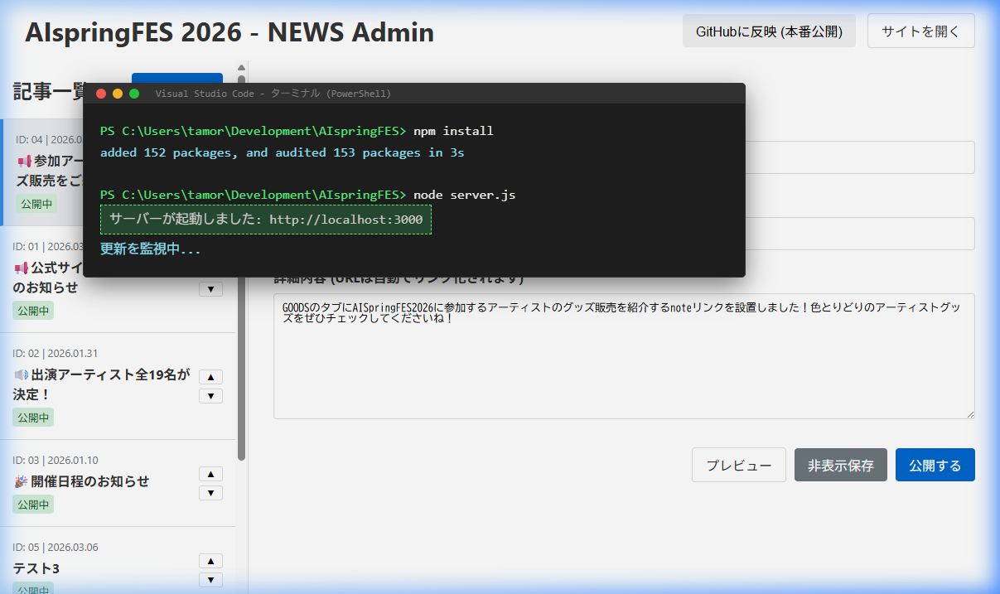
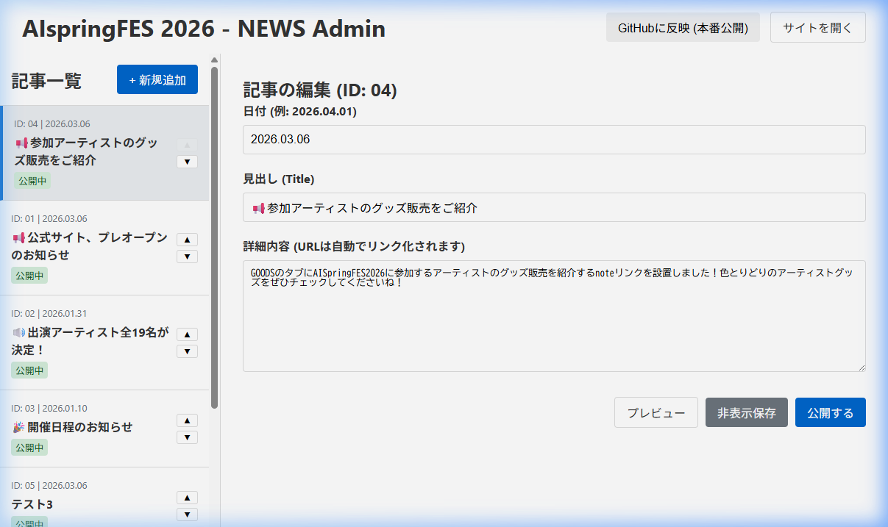
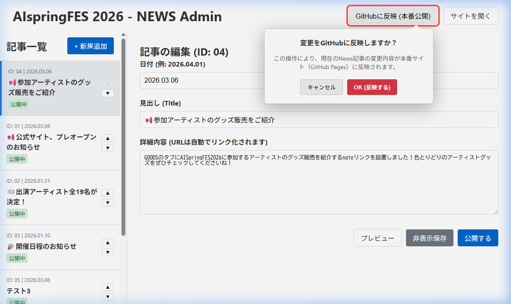

# AIspringFES 2026 NEWS管理ツール 利用マニュアル

本ドキュメントでは、ホームページの「NEWS」セクションを更新するための管理ツールの導入方法と操作手順について解説します。

---

## 1. 事前準備

ツールの実行には **Node.js** がインストールされている必要があります。

1.  **Node.jsの確認**: ターミナル（コマンドプロンプトやPowerShell）を開き、以下のコマンドを入力して `Enter` キーを押します。
    ```bash
    node -v
    ```
    ※バージョン数字が表示されれば準備完了です。表示されない場合は [Node.js公式サイト](https://nodejs.org/) から推奨版をインストールしてください。

2.  **依存ライブラリのインストールと起動**:
    ターミナルで順に以下のコマンドを実行します。

    *   **インストール（初回や更新時）**: 
        ```bash
        npm install
        ```
    *   **サーバーの起動**: 
        ```bash
        node server.js
        ```

    **【操作イメージ】**
    ターミナル（VS Code等の下部に表示される黒い画面）で以下のように表示されれば成功です。
    

---

## 2. ツールの起動方法

1.  上記の手順でサーバーを起動した状態にします（「サーバーが起動しました」が表示されていること）。
2.  ブラウザで以下のURLにアクセスしてください。
    *   **管理画面**: [http://localhost:3000/admin/index.html](http://localhost:3000/admin/index.html)
    *   **本番確認用**: [http://localhost:3000/index.html](http://localhost:3000/index.html)

---

## 3. 管理画面の操作説明

### 3.1 画面の構成
左側に「記事一覧」、右側に選択した記事の「編集エリア」が表示されます。



### 3.2 記事の追加・編集
*   一覧から記事を選ぶか、「+ 新規追加」で新しい記事を作成します。
*   見出し、日付、本文を入力し、下の「公開する」または「非表示保存」ボタンで保存します。
*   本文内のURLは、公開時に自動的にクリック可能なリンクへ変換されます。

### 3.3 順序の入れ替え
各記事の右端にある **「▲」「▼」ボタン** をクリックすると、即座に表示順序が入れ替わり、保存されます。

---

## 4. GitHubへの反映（本番公開）

ローカル環境での変更を世界中に公開するための重要な手順です。

1.  右上の **「GitHubに反映 (本番公開)」** ボタンをクリックします。
2.  以下の確認メッセージが表示されるので、内容を確認して **「OK (反映する)」** をクリックしてください。



*   **ステータス表示**: 実行中はボタンの横に「🔄 実行中」と表示され、完了すると「✔ 完了しました」に変わります。

---

## 5. 注意事項

*   **サーバーの停止**: 作業が終わったら、ターミナルで `Ctrl + C` を押すとサーバーを停止できます。
*   **ローカル専用**: この管理ツールは開発者のPC内でのみ動作します。外部から `http://localhost:3000` にアクセスすることはできません。
